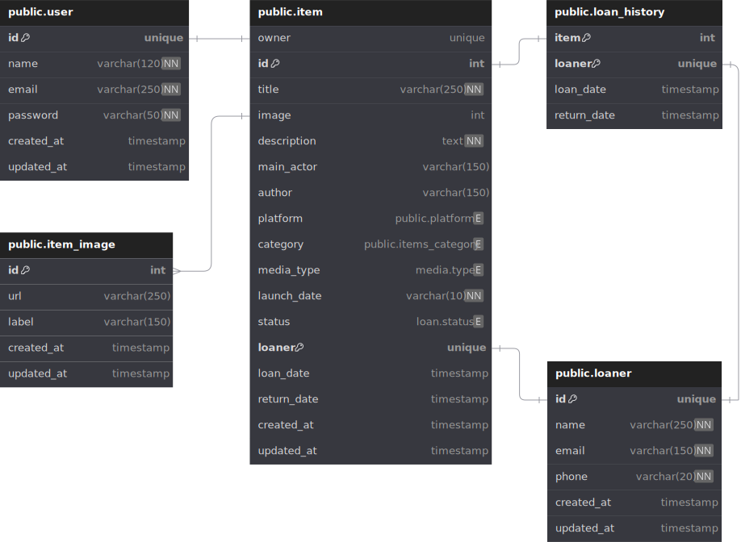

# CATALOG_API

Simple personal items catalog API that provides a CRUD structure for items and loan info registration.

## USAGE

In order to **RUN** this application you must:

Build the image

```
$ docker build -t catalog-image:latest .
```

To **RUN** the container use the following command:

```
$ docker-compose up
```

Then open a second terminal to access the container by running the following command:

```
$ docker exec -it catalog-api bash
```

Once inside the container **RUN** Django model migration command as the example bellow:

```
$ ./manage.py makemigrations
```

```
$ ./manage.py migrate
```

## DATABASE STRUCTURE


